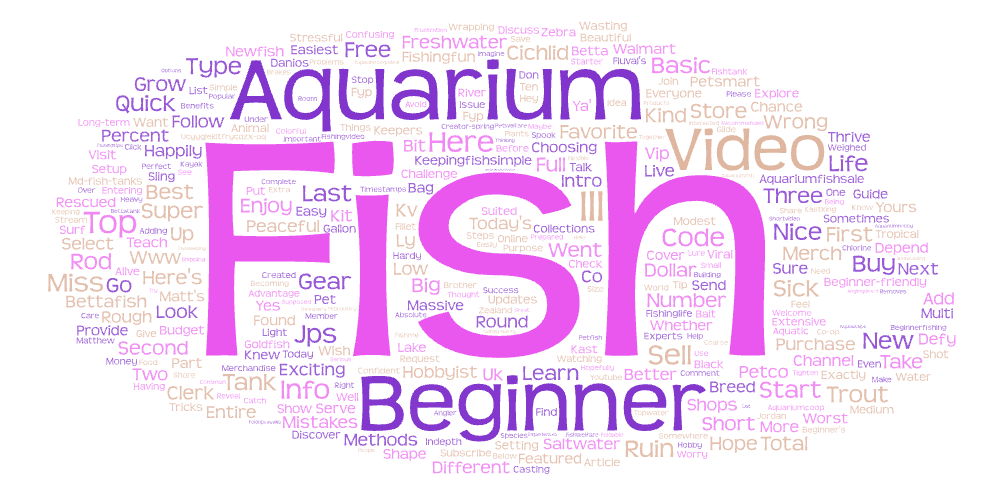
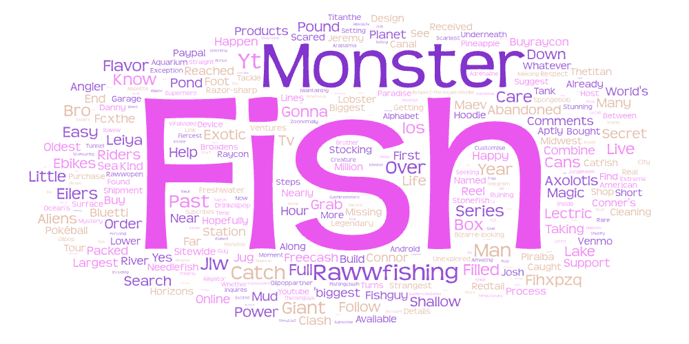

# Content differences in YouTube videos related to fishkeeping

This research explores content differences in YouTube videos related to fishkeeping, with a focus on two contrasting niches:
- Beginner Fish - This content is aimed at new or novice aquarium hobbyists
- Monster Fish - Aimed at large, giant, or exotic fish species for advanced keepers

## Search Parameters

### Platform: Youtube

#### Search Terms
>Beginner Fish 
- Aquarium
- Fish Keeping
- Beginner Fish
- New Fish Keeper

>Monster Fish
- Monster Fish
- Giant Monster
- Pro Fish Keeper

## Motivation to make this Comparison

There are many levels in fish keeping depending on the species of fish and the amount of room one has. I wanted to see the differences between the fish species and contents with the different search keywords. This also made me understand more about how beginner videos are more educational compared to larger species of fish. The task also help me understand the different levels of expertise and how risk shape online information sharing within the same hobby

## Word Clouds

### Beginner Fish Word Cloud

#### Key Terms
- Beginner
- Easy
- Guide
- Aquarium
- Set up
- Small
- Tank
- Betta
- Budget

### Monster Fish Word Cloud

#### Key Terms
- Monster
- Giat
- Exotic
- Rawwfishing
- Big
- Pond
- Predator
- Rare

#### Similarities
Both of the word clouds are mainly related to fishkeeping, with the word "fish" being the largest word in both of the images. They both create a great sense of belogging in the fish community and the hobby. With both the content being very community driven when it comes to content creation.

#### Differences
The Beginner Fish is more related to instructions and guides about fishkeeping for beginners. Generally the content is more related to smaller species of fish and is more informative. The monster fish on the other hand is more for exprienced people and much more entertaining compared to the informative beginner content.

## Reasons for Observed Patterns
- Target Audience. 
There is a different target audience for the word clouds, with one being focused for beginners and one for a more experienced group who might be looking to find some entertainment. 

- Size and risk.
Monster fish is generally harder to keep and require a larger size which is not meant for beginner, therefore the contents are going to be very different. As the larger or exotic the species the more parameters you will have to think about. 

- Content.
The content is aimed differently, with one being informative and one being entertainment/thrilling. We can see a general shift in interest as you begin to learn more about new species of fish or are advancing in the hobby.

## How Research Could be Improved

- Increase the word search.
As I used only 3 to 4 different ways to search for the topic there might be missing content

- Larger size.
The data collected didn't exceed 100 videos which might be bad when finalizing the data. There could be a lot of missing information or something is more heavily weighted because of the flawed search

- Engagement.
I wish to have an engagement matrix where I can see whether people acutally watch these videos. This way I would understand how many people are acutally interested in the contents. 

## Expectation VS Reality

As someone who had a lot of knowledge in this side of the hobby, I didn't really have high expectations for both of these since I generally know what it would be like. One thing that went over my head however, is how the beginner section generally doesn't talk about salt water fish which is a lot harder to keep. There is also a topic about how monster fish can sometimes be regarded with fishing for large fish in the rivers. Which wasn't what I intended to research about. 

## Download Data
- [Download Beginner Fish Results (CSV)](assets/begginerfish.csv)
- [Download Monster Fish Results (CSV)](assets/mosterfish.csv)